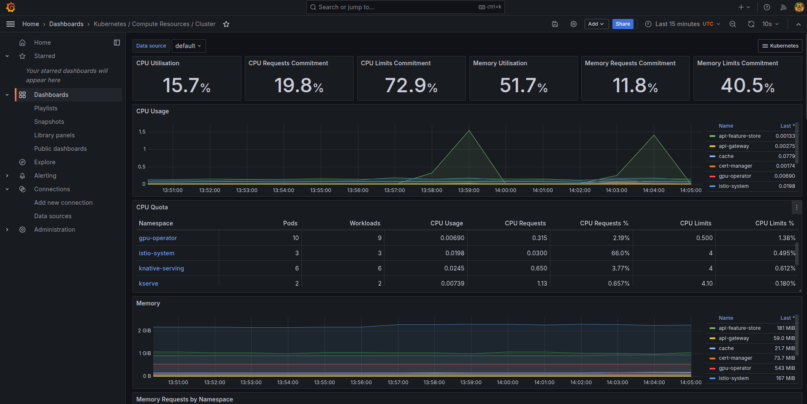
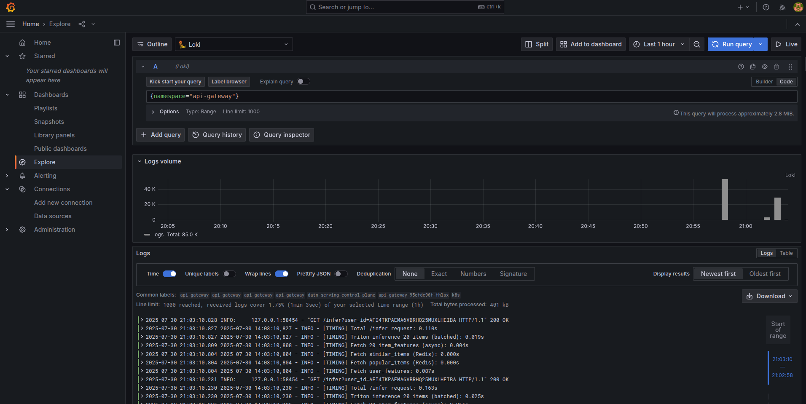
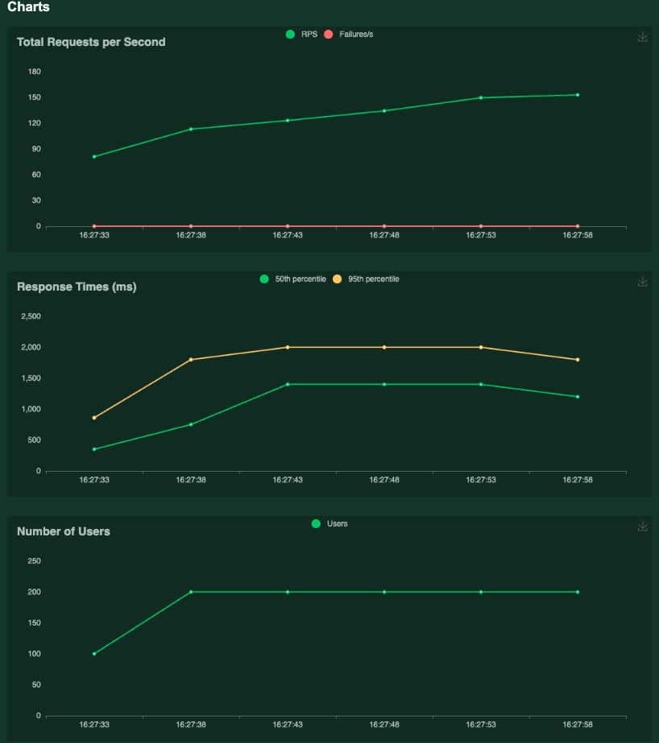
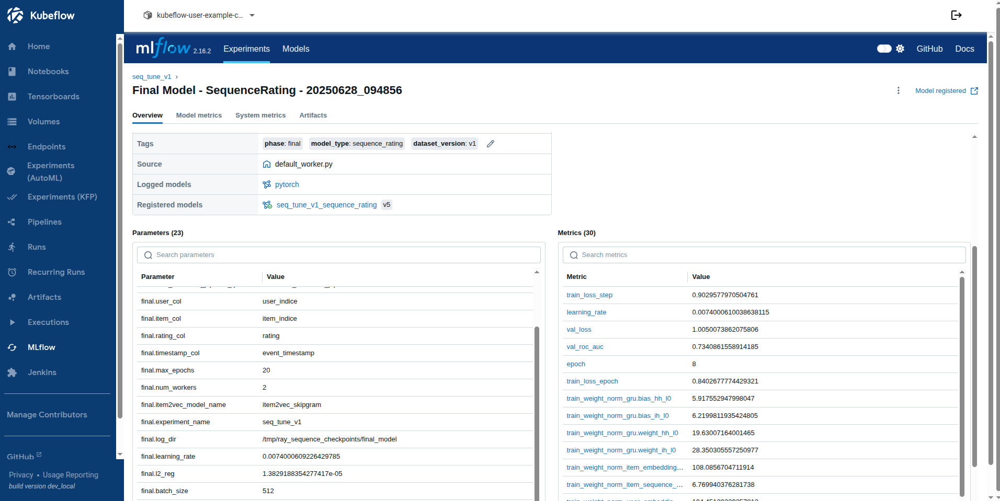

## Monitoring

1. **Install LGTM Stack Locally**:
   ```bash
   git clone https://github.com/daviaraujocc/lgtm-stack.git
   cd lgtm-stack
   make install-local # testing
   ```
2. **Retrieve Grafana Admin Password: Use the following command to get the admin password for Grafana:**
```bash
kubectl get secret -n monitoring lgtm-grafana -o jsonpath="{.data.admin-password}" | base64 -d
```
Default username: `admin`

3. **Apply Promtail Configuration: Apply the fixed Promtail configuration in the monitoring namespace:**
```bash
kubectl apply -f manifests/promtail.cri.yaml -n monitoring
```
4. **Grafana Dashboard:**
- 
5. **Loki Logs:**
- 

#### Throughput and performance of model
Run Locust Test: Execute the Locust test using the provided `locustfile.py`
- 
- 