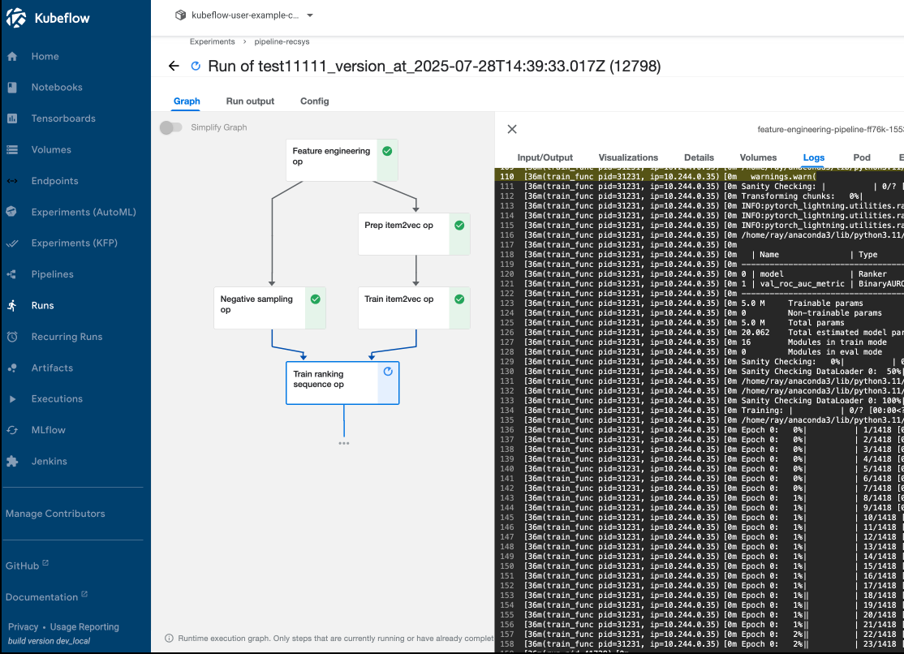
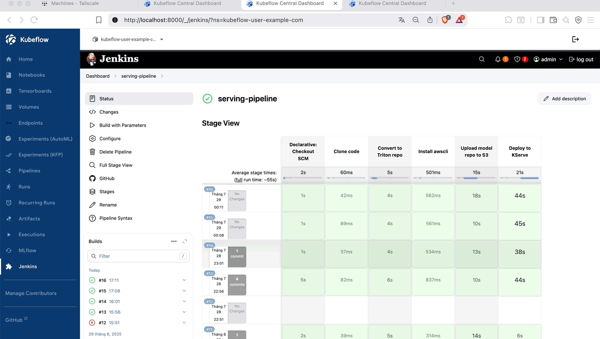

## Kubeflow Pipeline Training

This section describes how to build and run the **Feature Engineering Pipeline** using Kubeflow Pipelines. The pipeline automates feature engineering, negative sampling, Item2Vec preparation, and model training steps for your recommender system.

---

### Install Kubeflow

This guide explains how to install Kubeflow using the official [Kubeflow Manifests repository](https://github.com/kubeflow/manifests).

### Ray Cluster Setup

```bash
helm repo add kuberay https://ray-project.github.io/kuberay-helm/
helm repo update
cd helm/ray-cluster
docker build -t <username_dockerhub>/ray-cluster:v1 -f ray.Dockerfile .

kubens kubeflow-user-example-com
helm install kuberay-operator kuberay/kuberay-operator --version 1.3.0
kubectl apply -f https://raw.githubusercontent.com/rancher/local-path-provisioner/master/deploy/local-path-storage.yaml
kubectl apply -f ray-pvc.yaml
kubectl apply -f ray-worker-pvc.yaml
helm install raycluster .
```

*Port-forward to Ray Dashboard*
```
kubectl port-forward svc/raycluster-kuberay-head-svc 10001:10001 -n kubeflow-user-example-com
```

*Check GPU pods:*
```bash
kubectl get pods -n kubeflow-user-example-com -o json | jq '.items[] | select(.spec.containers[].resources.limits["nvidia.com/gpu"] != null) | .metadata.name'
```

---

### MLflow & Jenkins Integration

#### Deploy MLflow Tracking Server

Build the MLflow Docker image and deploy using Helm:

```bash
cd helm/mlflow-stack
docker build -t <username_dockerhub>/mlflow-kubeflow:v1 -f mlflow.Dockerfile .
helm upgrade mlflow-stack . -n mlflow --install --create-namespace
```

#### Deploy Jenkins CI/CD Server

Build the Jenkins Docker image and deploy with Helm:

```bash
cd helm/jenkins-stack
docker build -f Dockerfile.jenkins -t <username_dockerhub>/jenkins-datn:v1 .
helm upgrade jenkins-stack . -n devops-tools --install --create-namespace
```

**Retrieve Jenkins Admin Password:**

```bash
kubectl exec -n devops-tools -it jenkins-XXXXX -- cat /var/jenkins_home/secrets/initialAdminPassword
```
*(Replace `jenkins-XXXXX` with your Jenkins pod name.)*

#### Integrate MLflow & Jenkins into Kubeflow Dashboard

1. Export the current dashboard config:

   ```bash
   kubectl get configmap centraldashboard-config -n kubeflow -o yaml > dashboard-config.yaml
   ```

2. Add the following items to the `links` section in `dashboard-config.yaml`:

   ```yaml
   - type: item
     link: /mlflow/
     text: MLflow
     icon: icons:cached
   - type: item
     link: /jenkins/
     text: Jenkins
     icon: icons:extension
   ```

3. Apply the updated config and restart the dashboard:

   ```bash
   kubectl apply -f dashboard-config.yaml
   kubectl rollout restart deployment centraldashboard -n kubeflow
   ```

#### Access Kubeflow UI

Forward the Istio ingress gateway to access the Kubeflow dashboard locally:

```bash
kubectl port-forward svc/istio-ingressgateway 8000:80 -n istio-system
```
Then open [http://localhost:8000](http://localhost:8000) in your browser

---


### Feature Engineering Pipeline (Kubeflow)

#### Prepare Data on PVC

First, ensure your data and scripts are available on a Persistent Volume Claim (PVC):

```bash
cd feature_engineer
kubens kubeflow-user-example-com
kubectl apply -f pvc.yaml
kubectl apply -f copy-job.yaml
chmod +x copy-to-pvc.sh
./copy-to-pvc.sh
```

(Optional) Check the contents of the PVC:

```bash
kubectl apply -f - <<EOF
apiVersion: v1
kind: Pod
metadata:
  name: pvc-checker
spec:
  containers:
  - name: shell
    image: busybox
    command: ["sh", "-c", "sleep 3600"]
    volumeMounts:
    - name: data-volume
      mountPath: /data
  volumes:
  - name: data-volume
    persistentVolumeClaim:
      claimName: data-pvc
  restartPolicy: Never
EOF

kubectl exec -it pvc-checker -- sh
ls -lh /data
kubectl delete pod pvc-checker --force
```

#### Build and Load Pipeline Image

```bash
docker build -t kubeflow-pipeline:v1 .
```

#### Compile and Upload Pipeline

```bash
cd kfp_pipeline
uv run run_pipeline.py
```

- This will generate `feature_pipeline.yaml`.
- Go to the Kubeflow Pipelines UI, create a new pipeline or experiment, upload `feature_pipeline.yaml`, and run it.

---

### Pipeline Steps

The pipeline defined in [`kfp_pipeline/run_pipeline.py`](kfp_pipeline/run_pipeline.py) includes:

- **Feature Engineering**: Data transformation and feature extraction.
- **Negative Sampling**: Generate negative samples for training.
- **Item2Vec Preparation**: Prepare data for Item2Vec embedding.
- **Item2Vec Training**: Train the Item2Vec model.
- **Ranking Sequence Training**: Train the ranking model using sequential data.

Each step uses a shared PVC for data exchange and supports AWS credentials for S3/feature store access.


---

## Offline Caching

This system supports high-performance offline caching for vector search using either **Qdrant** or **S3 vector index** as the backend, and Redis as the serving cache.

### Deploy Qdrant

If you choose Qdrant as your vector store:

```bash
helm install qdrant helm/qdrant --namespace kubeflow-user-example-com
kubectl port-forward svc/qdrant 6333:6333 -n kubeflow-user-example-com
```

### Deploy Redis to Serving Cluster

Redis is used as the online cache for fast retrieval:

```bash
kubectl create ns cache
helm repo add bitnami https://charts.bitnami.com/bitnami
helm install redis bitnami/redis --version 21.0.2 --namespace cache --set-string auth.password=123456 --set master.service.type=LoadBalancer

kubectl port-forward svc/redis-master 6379:6379 -n cache
```

### Run Offline Caching Pipeline

Depending on your vector backend, run the appropriate pipeline to load vectors into Redis:

- **For Qdrant:**  
  Execute: `caching_offline/load2redis_qdrant.ipynb`


## CI/CD & Jenkins Integration

This section describes how to set up CI/CD automation for your MLOps workflow using Jenkins.

---

### Jenkins Plugins & Pipeline Setup

- Install the following Jenkins plugins: **Docker Pipeline**, **Kubernetes CLI**, **Stage View**.
- Create a pipeline from SCM (Source Control Management), add the necessary credentials, and run your pipeline.

---

### Port-forward Triton Predictor (for Testing)

To access the deployed Triton inference service:

```bash
kubectl port-forward pod/recsys-triton-predictor-XXXXX 8001:8001 -n kserve
```
*(Replace `recsys-triton-predictor-XXXXX` with your actual pod name.)*

---

### Model Promotion Watcher (Auto-trigger Jenkins Pipeline)

Automate model promotion and deployment with a watcher pod:

```bash
cd helm/jenkins-stack/watcher-pod
docker build -f Dockerfile.watcher -t <username_dockerhub>/model-promotion-watcher:v1 .
kubectl apply -f deployment.yaml
kubectl apply -f service.yaml
```

> **Note:**  
> In your Jenkins job, set the string parameters: `MODEL_NAME` and `MODEL_VERSION` as required for model promotion.

